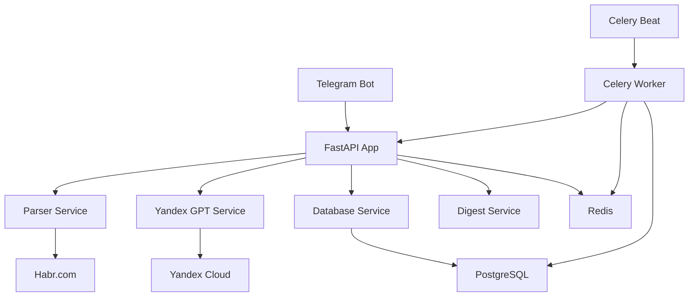

# 👨‍💻 Руководство разработчика HabrDigest

## 📋 Содержание

- [Настройка окружения](#настройка-окружения)
- [Структура проекта](#структура-проекта)
- [Архитектура](#архитектура)
- [Рабочий процесс](#рабочий-процесс)
- [Тестирование](#тестирование)
- [Код стайл](#код-стайл)
- [Отладка](#отладка)
- [Развертывание](#развертывание)

## 🛠️ Настройка окружения

### Предварительные требования

```bash
# Python 3.11+
python --version

# Git
git --version

# Docker (опционально)
docker --version

# Make (для Windows используйте WSL или Git Bash)
make --version
```

### Настройка проекта

```bash
# Клонирование
git clone <repository-url>
cd HabrDigest

# Создание виртуального окружения
python -m venv venv

# Активация (Windows)
venv\Scripts\activate
# Активация (Linux/macOS)
source venv/bin/activate

# Установка зависимостей
make install-dev

# Настройка переменных окружения
cp env.example .env
# Отредактируйте .env файл

# Инициализация базы данных
make db-init
```

### Проверка установки

```bash
# Запуск тестов
make test

# Проверка кода
make lint

# Форматирование
make format

# Полная проверка
make check-full
```

## 📁 Структура проекта

```
HabrDigest/
├── app/                          # Основное приложение
│   ├── __init__.py
│   ├── api/                      # FastAPI роуты
│   │   ├── __init__.py
│   │   └── database.py           # API для базы данных
│   ├── bot/                      # Telegram бот
│   │   ├── __init__.py
│   │   ├── bot.py                # Основной класс бота
│   │   └── handlers.py           # Обработчики команд
│   ├── core/                     # Конфигурация
│   │   ├── __init__.py
│   │   └── config.py             # Настройки приложения
│   ├── database/                 # Работа с базой данных
│   │   ├── __init__.py
│   │   ├── database.py           # Подключение к БД
│   │   └── models.py             # SQLAlchemy модели
│   └── services/                 # Бизнес-логика
│       ├── __init__.py
│       ├── ai_service.py         # AI сервис (устарел)
│       ├── yandex_service.py     # Yandex GPT сервис
│       ├── parser_service.py     # Парсинг Хабра
│       ├── database_service.py   # Работа с БД
│       └── digest_service.py     # Отправка дайджестов
├── celery_app/                   # Celery задачи
│   ├── __init__.py
│   ├── celery_app.py             # Конфигурация Celery
│   └── tasks.py                  # Фоновые задачи
├── migrations/                   # Миграции базы данных
│   ├── env.py
│   ├── script.py.mako
│   └── versions/
│       ├── 0001_initial_schema.py
│       └── 0002_add_default_topics.py
├── scripts/                      # Скрипты
│   ├── start_dev.sh              # Запуск в разработке
│   ├── start_prod.sh             # Запуск в продакшене
│   ├── db_init.sh                # Инициализация БД
│   └── db_reset.sh               # Сброс БД
├── tests/                        # Тесты
│   ├── __init__.py
│   ├── conftest.py               # Конфигурация pytest
│   ├── test_api.py               # Тесты API
│   └── test_database_service.py  # Тесты сервиса БД
├── docs/                         # Документация
│   ├── QUICK_START.md            # Быстрый старт
│   ├── SETUP.md                  # Полная настройка
│   ├── YANDEX_SETUP.md           # Настройка Yandex GPT
│   ├── DATABASE.md               # Работа с БД
│   ├── API.md                    # API документация
│   └── DEVELOPMENT.md            # Это руководство
├── .env                          # Переменные окружения
├── .env.example                  # Пример переменных
├── .gitignore                    # Игнорируемые файлы
├── alembic.ini                   # Конфигурация Alembic
├── docker-compose.yml            # Docker Compose
├── Dockerfile                    # Docker образ
├── main.py                       # Точка входа
├── Makefile                      # Команды для разработки
├── pytest.ini                    # Конфигурация pytest
├── README.md                     # Основная документация
├── requirements.txt              # Зависимости
├── requirements-dev.txt          # Зависимости для разработки
├── CONTRIBUTING.md               # Правила контрибьюции
└── LICENSE                       # Лицензия
```

## 🏗️ Архитектура

### Компоненты системы



### Поток данных

1. **Парсинг**: Celery Beat запускает задачу парсинга
2. **Обработка**: Celery Worker обрабатывает новые статьи
3. **AI**: Yandex GPT генерирует резюме
4. **Хранение**: Данные сохраняются в PostgreSQL
5. **Уведомления**: Digest Service отправляет дайджесты пользователям

### Основные сервисы

#### DatabaseService
```python
# Основной сервис для работы с базой данных
from app.services.database_service import DatabaseService

with DatabaseService() as db:
    # Работа с пользователями
    user = db.get_user_by_telegram_id(123456789)
    
    # Работа с темами
    topics = db.get_active_topics()
    
    # Работа с подписками
    subscription = db.create_subscription(user_id=1, topic_id=1)
```

#### YandexGPTService
```python
# Сервис для работы с Yandex GPT
from app.services.yandex_service import YandexGPTService

yandex_service = YandexGPTService()
summary = yandex_service.generate_summary("Текст статьи...")
```

#### ParserService
```python
# Сервис для парсинга Хабра
from app.services.parser_service import ParserService

parser = ParserService()
articles = parser.parse_articles("python", limit=10)
```

#### DigestService
```python
# Сервис для отправки дайджестов
from app.services.digest_service import DigestService

digest_service = DigestService()
digest_service.send_digest_to_all_users()
```

## 🔄 Рабочий процесс

### Разработка новой функции

1. **Создание ветки**
```bash
git checkout -b feature/new-feature
```

2. **Разработка**
```bash
# Редактирование кода
# Запуск тестов
make test

# Проверка кода
make lint
```

3. **Коммит**
```bash
# Форматирование
make format

# Коммит с conventional commit
git commit -m "feat: add new feature"
```

4. **Пуш и PR**
```bash
git push origin feature/new-feature
# Создать Pull Request
```

### Conventional Commits

```bash
# Типы коммитов
feat:     # Новая функция
fix:      # Исправление бага
docs:     # Документация
style:    # Форматирование
refactor: # Рефакторинг
test:     # Тесты
chore:    # Обслуживание
```

### Примеры коммитов

```bash
feat: add user subscription management
fix: resolve database connection issue
docs: update API documentation
style: format code with black
refactor: extract common database logic
test: add unit tests for parser service
chore: update dependencies
```

## 🧪 Тестирование

### Запуск тестов

```bash
# Все тесты
make test

# Тесты с покрытием
make test-cov

# Быстрые тесты
make test-fast

# Конкретный тест
pytest tests/test_api.py::test_health_check -v
```

### Написание тестов

#### Структура теста
```python
import pytest
from app.services.database_service import DatabaseService

class TestDatabaseService:
    @pytest.fixture
    def db_service(self):
        """Фикстура для создания сервиса БД"""
        return DatabaseService()
    
    def test_create_user(self, db_service):
        """Тест создания пользователя"""
        # Arrange
        telegram_id = 123456789
        username = "test_user"
        
        # Act
        user = db_service.create_user(telegram_id, username, "Test", "User")
        
        # Assert
        assert user.telegram_id == telegram_id
        assert user.username == username
        assert user.is_active == True
```

#### Фикстуры в conftest.py
```python
import pytest
from sqlalchemy import create_engine
from sqlalchemy.orm import sessionmaker

@pytest.fixture
def test_db():
    """Создание тестовой базы данных"""
    engine = create_engine("sqlite:///:memory:")
    TestingSessionLocal = sessionmaker(autocommit=False, autoflush=False, bind=engine)
    
    # Создание таблиц
    Base.metadata.create_all(bind=engine)
    
    yield TestingSessionLocal()
    
    # Очистка
    Base.metadata.drop_all(bind=engine)
```

### Моки и стабы

```python
import pytest
from unittest.mock import Mock, patch

def test_yandex_service_with_mock():
    """Тест с моком Yandex API"""
    with patch('app.services.yandex_service.httpx.post') as mock_post:
        # Настройка мока
        mock_post.return_value.json.return_value = {
            "result": {"alternatives": [{"message": {"text": "Test summary"}}]}
        }
        mock_post.return_value.status_code = 200
        
        # Тест
        service = YandexGPTService()
        summary = service.generate_summary("Test text")
        
        assert summary == "Test summary"
        mock_post.assert_called_once()
```

## 📝 Код стайл

### Форматирование

```bash
# Автоматическое форматирование
make format

# Проверка линтером
make lint
```

### Правила кода

#### Python
- **PEP 8**: Основные правила
- **Black**: Автоматическое форматирование
- **isort**: Сортировка импортов
- **flake8**: Проверка стиля

#### Именование
```python
# Классы: PascalCase
class DatabaseService:
    pass

# Функции и переменные: snake_case
def create_user(telegram_id: int, username: str) -> User:
    pass

# Константы: UPPER_SNAKE_CASE
MAX_ARTICLES_PER_PARSING = 50

# Приватные методы: _prefix
def _validate_user_data(self, data: dict) -> bool:
    pass
```

#### Типизация
```python
from typing import List, Optional, Dict, Any
from pydantic import BaseModel

class UserCreate(BaseModel):
    telegram_id: int
    username: str
    first_name: Optional[str] = None

def get_users(limit: int = 100) -> List[User]:
    pass

def process_article(article_data: Dict[str, Any]) -> Optional[Article]:
    pass
```

#### Документация
```python
def generate_summary(text: str, max_length: int = 200) -> str:
    """
    Генерирует краткое резюме текста с помощью Yandex GPT.
    
    Args:
        text: Исходный текст для обработки
        max_length: Максимальная длина резюме
        
    Returns:
        Сгенерированное резюме
        
    Raises:
        YandexAPIError: При ошибке API
        ValueError: При неверных параметрах
    """
    pass
```

## 🐛 Отладка

### Логирование

```python
from loguru import logger

# Настройка логов
logger.add("logs/habrdigest.log", rotation="1 day", retention="7 days")

# Использование
logger.info("Пользователь создан", user_id=123)
logger.error("Ошибка API", exc_info=True)
logger.debug("Детали запроса", request_data=data)
```

### Отладка в коде

```python
import ipdb  # для разработки

def complex_function():
    # Точка останова
    ipdb.set_trace()
    
    # Код для отладки
    result = process_data()
    return result
```

### Отладка API

```bash
# Запуск с отладкой
uvicorn main:app --reload --log-level debug

# Проверка эндпоинтов
curl -X GET http://localhost:8000/health
curl -X GET http://localhost:8000/docs
```

### Отладка базы данных

```python
# Включение SQL логов
import logging
logging.getLogger('sqlalchemy.engine').setLevel(logging.INFO)

# Проверка подключения
from app.database.database import engine
with engine.connect() as conn:
    result = conn.execute("SELECT 1")
    print(result.fetchone())
```

### Отладка Celery

```bash
# Запуск worker с отладкой
celery -A celery_app.celery_app worker --loglevel=debug

# Мониторинг задач
celery -A celery_app.celery_app flower

# Проверка очереди
celery -A celery_app.celery_app inspect active
```

## 🚀 Развертывание

### Локальное развертывание

```bash
# Запуск всех сервисов
make dev

# Или по отдельности
python main.py &
make celery-worker &
make celery-beat &
```

### Docker развертывание

```bash
# Сборка и запуск
make docker-build
make docker-run

# Проверка статуса
docker-compose ps

# Просмотр логов
make docker-logs
```

### Продакшен развертывание

```bash
# Настройка переменных окружения
cp env.example .env.prod
# Отредактируйте .env.prod

# Запуск в продакшене
ENVIRONMENT=production make prod

# Мониторинг
make status
```

### CI/CD

```yaml
# .github/workflows/tests.yml
name: Tests
on: [push, pull_request]
jobs:
  test:
    runs-on: ubuntu-latest
    services:
      postgres:
        image: postgres:15
        env:
          POSTGRES_PASSWORD: password
      redis:
        image: redis:7-alpine
    steps:
      - uses: actions/checkout@v3
      - name: Set up Python
        uses: actions/setup-python@v4
        with:
          python-version: '3.11'
      - name: Install dependencies
        run: |
          pip install -r requirements.txt
          pip install -r requirements-dev.txt
      - name: Run tests
        run: make test
```

## 📚 Полезные ресурсы

### Документация
- [FastAPI](https://fastapi.tiangolo.com/)
- [SQLAlchemy](https://docs.sqlalchemy.org/)
- [Alembic](https://alembic.sqlalchemy.org/)
- [Celery](https://docs.celeryproject.org/)
- [Aiogram](https://docs.aiogram.dev/)

### Инструменты
- [Black](https://black.readthedocs.io/)
- [isort](https://pycqa.github.io/isort/)
- [flake8](https://flake8.pycqa.org/)
- [pytest](https://docs.pytest.org/)

### Лучшие практики
- [Python Code Style](https://www.python.org/dev/peps/pep-0008/)
- [FastAPI Best Practices](https://fastapi.tiangolo.com/tutorial/best-practices/)
- [SQLAlchemy Best Practices](https://docs.sqlalchemy.org/en/14/orm/best_practices.html)

## 🆘 Поддержка

### Частые проблемы

#### Проблемы с зависимостями
```bash
# Очистка и переустановка
make clean
make install-dev
```

#### Проблемы с базой данных
```bash
# Сброс и переинициализация
make db-reset
make db-init
```

#### Проблемы с Docker
```bash
# Очистка Docker
make docker-clean
make docker-build
make docker-run
```

### Получение помощи

1. **Проверьте логи**: `make logs`
2. **Изучите документацию**: папка `docs/`
3. **Создайте issue**: в репозитории проекта
4. **Обратитесь к сообществу**: через Telegram или GitHub

### Контакты

- **Репозиторий**: [GitHub](https://github.com/your-username/habrdigest)
- **Документация**: [docs/](docs/)
- **Issues**: [GitHub Issues](https://github.com/your-username/habrdigest/issues) 