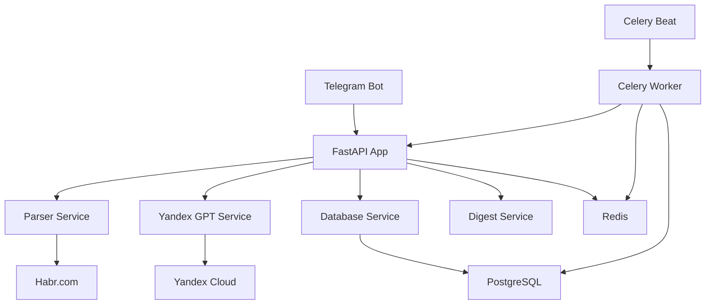

# 📚 Документация HabrDigest

Добро пожаловать в документацию проекта **HabrDigest** - AI-ассистента для IT-статей с Хабра!

## 🚀 Быстрый старт

Если вы хотите быстро запустить проект, начните с:

**[🚀 Быстрый запуск](QUICK_START.md)** - Получите работающий проект за 5 минут

## 📖 Полная документация

### 🛠️ Настройка и установка

- **[🚀 Быстрый запуск](QUICK_START.md)** - Быстрый старт за 5 минут
- **[⚙️ Полная настройка](SETUP.md)** - Детальная настройка проекта
- **[🤖 Настройка Yandex GPT](YANDEX_SETUP.md)** - Инструкции по настройке AI
- **[🗄️ База данных](DATABASE.md)** - Работа с PostgreSQL

### 🔧 Разработка

- **[👨‍💻 Руководство разработчика](DEVELOPMENT.md)** - Полное руководство для разработчиков
- **[🔌 API документация](API.md)** - Описание REST API эндпоинтов

### 📋 Справочники

- **[📋 Makefile команды](../Makefile)** - Удобные команды для разработки
- **[🐳 Docker](../docker-compose.yml)** - Контейнеризация проекта
- **[🧪 Тесты](../tests/)** - Тестирование проекта

## 🎯 Для кого эта документация

### 👤 Пользователи
Если вы хотите **использовать** HabrDigest:
1. Начните с [Быстрого запуска](QUICK_START.md)
2. Настройте [Yandex GPT](YANDEX_SETUP.md)
3. Изучите [Полную настройку](SETUP.md)

### 👨‍💻 Разработчики
Если вы хотите **разрабатывать** HabrDigest:
1. Изучите [Руководство разработчика](DEVELOPMENT.md)
2. Ознакомьтесь с [API документацией](API.md)
3. Изучите [работу с базой данных](DATABASE.md)

### 🔧 Администраторы
Если вы хотите **развернуть** HabrDigest:
1. Изучите [Полную настройку](SETUP.md)
2. Настройте [базу данных](DATABASE.md)
3. Ознакомьтесь с [Docker развертыванием](../docker-compose.yml)

## 🏗️ Архитектура проекта



## 🛠️ Технологический стек

| Компонент | Технология | Описание |
|-----------|------------|----------|
| **Backend** | FastAPI | Современный веб-фреймворк |
| **База данных** | PostgreSQL | Надежная СУБД |
| **ORM** | SQLAlchemy | ORM для Python |
| **Миграции** | Alembic | Управление схемой БД |
| **Telegram Bot** | Aiogram | Библиотека для Telegram |
| **AI** | Yandex GPT | Генерация резюме |
| **Парсинг** | aiohttp + BeautifulSoup | Асинхронный парсинг |
| **Очереди** | Celery + Redis | Фоновые задачи |
| **Контейнеризация** | Docker + Docker Compose | Развертывание |
| **Тестирование** | pytest | Unit и интеграционные тесты |

## 📊 Основные возможности

### 🤖 AI-ассистент
- **Парсинг статей** с Хабра по IT-темам
- **AI-резюме** с помощью Yandex GPT
- **Умная фильтрация** по интересам пользователей

### 📱 Telegram Bot
- **Интерактивный выбор тем** с кнопками
- **Настройка частоты** получения дайджестов
- **Персонализированные уведомления**

### 🗄️ База данных
- **PostgreSQL** для надежного хранения
- **Миграции** для управления схемой
- **API** для мониторинга и управления

### 🔄 Автоматизация
- **Планировщик задач** Celery Beat
- **Фоновые процессы** Celery Worker
- **Мониторинг** и логирование

## 🚀 Быстрый старт (5 минут)

```bash
# 1. Клонирование
git clone <repository-url>
cd HabrDigest

# 2. Настройка окружения
python -m venv venv
venv\Scripts\activate  # Windows
source venv/bin/activate  # Linux/macOS

# 3. Установка зависимостей
pip install -r requirements.txt

# 4. Настройка конфигурации
cp env.example .env
# Отредактируйте .env

# 5. Запуск базы данных
docker-compose up -d postgres redis

# 6. Инициализация БД
make db-init

# 7. Запуск приложения
make dev
```

## 📈 Статистика проекта

- **Строк кода**: ~5000+
- **Тестов**: ~50+
- **API эндпоинтов**: ~20+
- **Поддерживаемых тем**: ~25+
- **Компонентов**: ~10+

## 🔗 Полезные ссылки

### 📚 Документация
- **[Быстрый запуск](QUICK_START.md)** - Начните здесь
- **[Полная настройка](SETUP.md)** - Детальная настройка
- **[API документация](API.md)** - REST API
- **[Разработка](DEVELOPMENT.md)** - Для разработчиков

### 🛠️ Инструменты
- **[Makefile](../Makefile)** - Команды для разработки
- **[Docker Compose](../docker-compose.yml)** - Контейнеризация
- **[GitHub Actions](../.github/workflows/)** - CI/CD

### 📊 Мониторинг
- **API**: http://localhost:8000/docs
- **Health Check**: http://localhost:8000/health
- **Статистика**: http://localhost:8000/api/database/statistics

## 🆘 Поддержка

### Частые проблемы
1. **Проблемы с зависимостями**: `make clean && make install`
2. **Проблемы с БД**: `make db-reset && make db-init`
3. **Проблемы с Docker**: `make docker-clean && make docker-run`

### Получение помощи
1. **Проверьте логи**: `make logs`
2. **Изучите документацию**: папка `docs/`
3. **Создайте issue**: в репозитории проекта
4. **Обратитесь к сообществу**: через Telegram или GitHub

## 📝 Вклад в проект

Хотите внести вклад в проект? Изучите:

- **[CONTRIBUTING.md](../CONTRIBUTING.md)** - Правила контрибьюции
- **[DEVELOPMENT.md](DEVELOPMENT.md)** - Руководство разработчика
- **[LICENSE](../LICENSE)** - Лицензия проекта

## 📄 Лицензия

Проект распространяется под лицензией MIT. Подробности в файле [LICENSE](../LICENSE).

---

**HabrDigest** - AI-ассистент для IT-статей с Хабра 🚀

*Создано с ❤️ для IT-сообщества* 